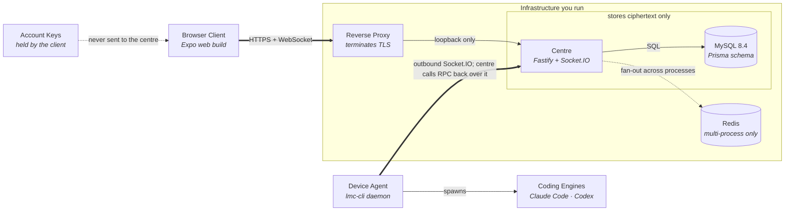
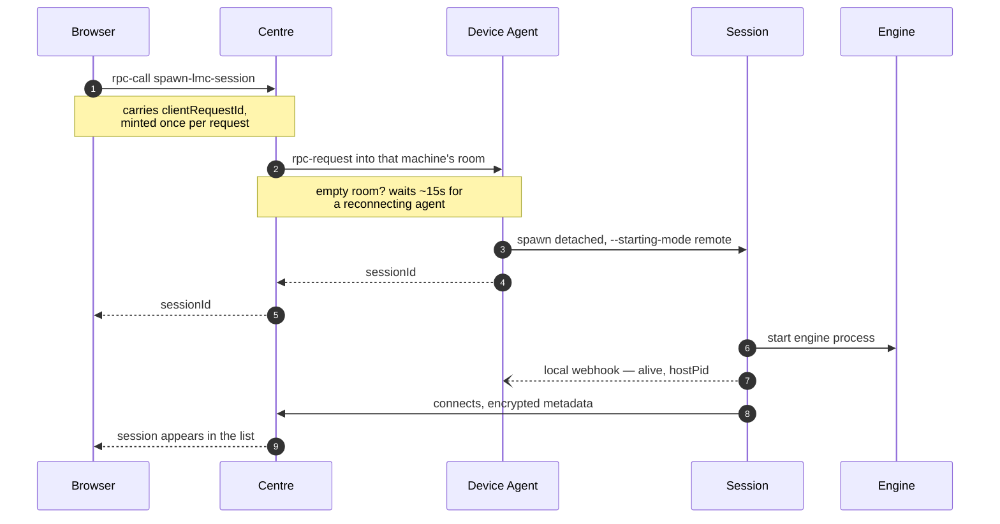
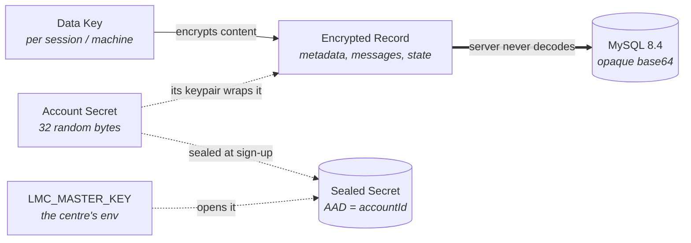

# LMC — Link my Cli

A self-hosted web workspace for your coding agents. Run **Codex** and **Claude Code** on
your own machines, drive them from a browser, and keep every byte on infrastructure you
control.


*Screenshot of the web client with demo content: manage sessions across devices, follow agent progress, and queue or steer the next instruction.*

LMC is a fork of [Happy](https://github.com/slopus/happy) that removes the dependency on
any hosted account: no vendor sign-in, no phone app, no telemetry. You run the centre, you
hold the keys.

> **Status:** self-hosted candidate. The deployment path below is what the maintainers run
> daily. Mobile builds still carry upstream's store identity — see [Known limits](#known-limits).

---

## Why this exists

Coding agents are stuck on the machine you started them on. Happy solved that with a hosted
relay. LMC keeps the remote-control model but moves the relay onto your own box, because the
sessions it carries are your source code.

- **Your infrastructure.** One `docker compose` stack: MySQL plus the centre. Put your own
  reverse proxy in front of it.
- **Your account.** Username and password you create at install time. No external identity
  provider, no OAuth round-trip to a vendor.
- **Your keys.** Messages stay under the upstream end-to-end encryption scheme; account keys
  are wrapped by your own centre. The centre operator is inside the trust boundary — no one
  else is.

## What it does

- **Browser workspace** — sessions, devices, projects and per-session model configuration.
- **Multi-engine** — Codex and Claude Code are first class; Gemini and any
  [ACP](https://agentclientprotocol.com)-compatible agent run through the same session model.
- **Device agents** — a small daemon per machine. It connects outbound to the centre, so the
  machines running your agents need no inbound ports.
- **Hub and workers** — one session can dispatch tasks to executor sessions on other
  machines, review their reports, and account for spend per task.
- **Live handover** — switch a running session between engines, resume it later, or move it
  to another device.

## Architecture



- **Agents dial out**, so no machine running an engine needs an inbound port.
  The centre reaches back over that same socket to start a session.
- **Session records reach the centre already encrypted.** The operator holds the
  key that wraps account keys — self-hosting moves that trust to you, it does not
  remove it.
- Redis is only needed to fan out across multiple centre processes.

An explorable version with guided views is in
[`docs/diagrams/architecture.html`](docs/diagrams/architecture.html)
(open it locally; GitHub will not render it inline).

### Starting a session on another machine



The ack returns as soon as the process is spawned; the session then reports its pid
to the agent locally and connects to the centre itself. `clientRequestId` is what makes
a retry safe — without it, a call that timed out *after* the agent had already spawned
would create a second session in the same directory.

Interactive version:
[`docs/diagrams/spawn-session.html`](docs/diagrams/spawn-session.html).

### Who holds which key



Session metadata, messages, agent and machine state are encrypted on the client with a
per-record data key; the centre stores base64 it never decodes. **The one exception is the
account secret**: `lmc/auth.ts` seals it with `LMC_MASTER_KEY` (AES-256-GCM, AAD bound to
the account id), so whoever holds that key *and* the database can unwrap an account. That
is exactly the boundary self-hosting moves to you.

Interactive version: [`docs/diagrams/encryption.html`](docs/diagrams/encryption.html).
Full protocol detail: [`docs/encryption.md`](docs/encryption.md).

## Quick start

Requirements: **Node 22.18+**, **pnpm 10.11** (or corepack), **Docker Compose**.

```sh
git clone https://github.com/MoeAisaka/lmc-workspace.git
cd lmc-workspace
deploy/lmc/up.sh https://lmc.example.com
```

That one command installs dependencies, builds the wire types and Prisma client, exports the
web bundle, writes `.env`, starts MySQL, builds the centre image, runs migrations, and — on
the first run — prompts you to create a sign-in.

Run the same command again to update. `.env` is never overwritten, and the web bundle is
built beside the live one and swapped atomically, so tabs open during a deploy keep working.

```sh
deploy/lmc/up.sh --add-account     # add another sign-in
```

**The centre publishes on loopback only.** It expects your reverse proxy to terminate TLS and
forward `Host`, `Origin` and the WebSocket upgrade. It does not put itself on the internet.

### Connect a machine

On any machine you want to drive, build and link the CLI, then point it at your centre:

```sh
pnpm install
pnpm --filter link-my-cli cli:install    # builds, links `lmc` globally, restarts the daemon

export LMC_SERVER_URL=https://lmc.example.com
export LMC_WEBAPP_URL=https://lmc.example.com
lmc daemon start
```

> The CLI is **not on npm yet** — `npm i -g happy` installs upstream's package, not this one.
> Build from this repo until a release is published.

Then open your centre in a browser, sign in, and pair the machine. Pairing is explicit and
revocable.

```sh
lmc              # start Claude Code with browser control
lmc codex        # start Codex
lmc doctor       # diagnostics
```

## Documentation

| Topic | Where |
|---|---|
| Deploying the centre | [`deploy/lmc/README.md`](deploy/lmc/README.md) |
| Protocol and wire format | [`docs/protocol.md`](docs/protocol.md), [`docs/session-protocol.md`](docs/session-protocol.md) |
| Encryption model | [`docs/encryption.md`](docs/encryption.md) |
| Centre internals | [`docs/backend-architecture.md`](docs/backend-architecture.md) |
| CLI and daemon | [`docs/cli-architecture.md`](docs/cli-architecture.md) |
| Contributing | [`docs/CONTRIBUTING.md`](docs/CONTRIBUTING.md) |

## Known limits

Stated plainly, because they matter before you adopt this:

- **Mobile and desktop builds still carry upstream's store identity.** The iOS bundle IDs,
  Firebase project, Apple team and Developer ID signing certificate belong to Happy's
  publisher. Shipping your own mobile build means your own Apple / Play / Firebase accounts.
  The **web client is unaffected** and is the supported way to use LMC.
- **The centre operator can read what the centre stores.** End-to-end encryption protects
  data in transit and at rest against everyone except the person holding the account keys.
  Self-hosting moves that trust to you; it does not remove it.
- **Voice, push notifications and paid vendor SDKs are not wired up.** They were removed
  rather than pointed at our own infrastructure.
- **Some identifiers still read `happy`** — environment variables, MCP tool names, the
  encryption salts and a few protocol fields. They are compatibility surfaces, not a
  dependency on any hosted service. See
  [`docs/plans/contract-surface-rename.md`](docs/plans/contract-surface-rename.md).

## Relationship to upstream

LMC forked [`slopus/happy`](https://github.com/slopus/happy) in September 2026 and tracks it
selectively. Upstream's product names — Happy Agent, Happy Terminal, `@slopus/*` packages —
are kept where they refer to upstream's own software.

## License

MIT. See [LICENSE](LICENSE).

---

[中文说明](README.zh-CN.md)
