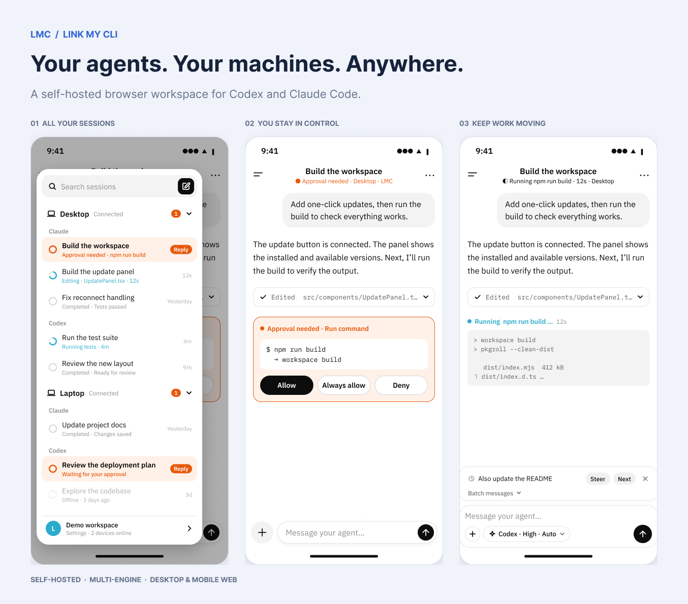
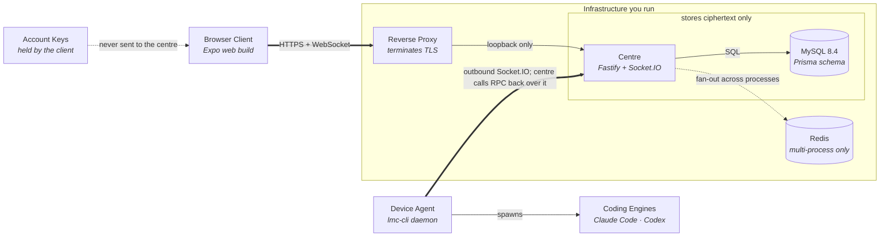
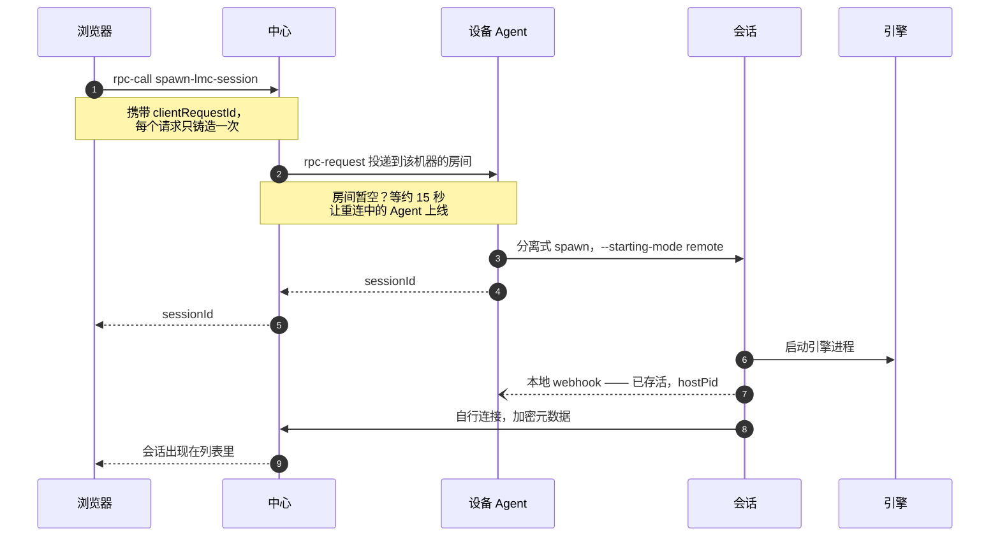
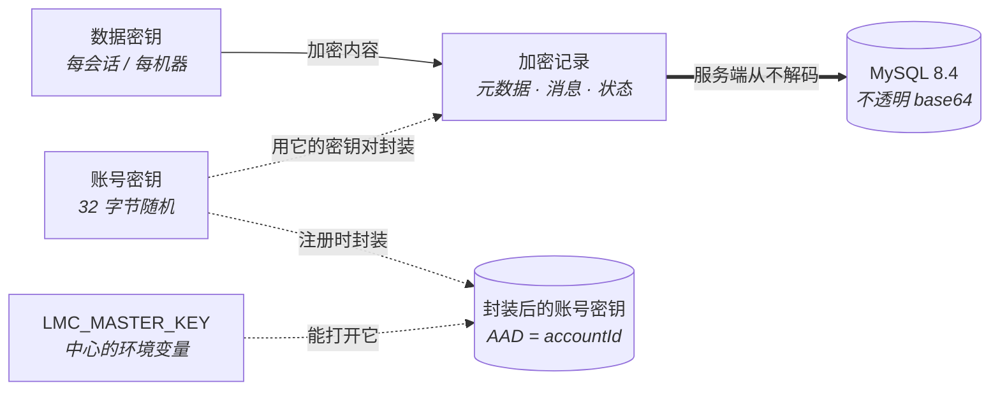

# LMC — Link my Cli

给编码 Agent 用的自托管 Web 工作空间。在你自己的机器上跑 **Codex** 与 **Claude Code**，
从浏览器驱动它们，所有数据留在你控制的基础设施里。



*高保真 UI 预览，使用演示内容：在浏览器里管理会话、审批操作，并排队下一条指令。*

LMC 是 [Happy](https://github.com/slopus/happy) 的分叉，去掉了对托管账号的依赖：
不需要厂商登录、不需要手机 App、没有遥测。中心由你运行，密钥在你手里。

> **状态：** 自托管候选版。下面的部署路径就是维护者每天在跑的。移动端构建仍带着上游的
> 商店身份，见[已知限制](#已知限制)。

---

## 为什么做这个

编码 Agent 被钉在你启动它的那台机器上。Happy 用一个托管中继解决了这件事。
LMC 保留远程控制模型，但把中继搬到你自己的机器上——因为它承载的会话就是你的源代码。

- **你的基础设施。** 一个 `docker compose` 栈：MySQL 加中心。反向代理由你自己放在前面。
- **你的账号。** 安装时自己创建用户名和口令。没有外部身份提供方，不向厂商做 OAuth 往返。
- **你的密钥。** 消息沿用上游的端到端加密方案，账号密钥由你自己的中心封装。
  **中心管理员在信任边界之内**——除此之外没有别人。

## 能做什么

- **浏览器工作空间** —— 会话、设备、项目，以及按会话配置模型。
- **多引擎** —— Codex 与 Claude Code 是一等公民；Gemini 和任何兼容
  [ACP](https://agentclientprotocol.com) 的 Agent 走同一套会话模型。
- **设备 Agent** —— 每台机器一个小守护进程，**向外连接**中心，所以跑 Agent 的机器不需要开入站端口。
- **总控与执行单元** —— 一个会话可以向其它机器上的执行会话派任务、验收报告、按任务记花费。
- **在线交接** —— 运行中的会话可在引擎之间切换、稍后恢复，或迁到另一台设备。

## 架构



- **Agent 向外拨号**，所以跑引擎的机器不需要开任何入站端口。中心通过同一条 socket 反向发起 RPC 来起会话。
- **会话记录到达中心时已经是密文。** 中心管理员持有封装账号密钥的那把钥匙——自托管把这份信任转移给你，而不是消除它。
- Redis 只在中心需要多进程扇出时才需要。

带引导视图的可交互版本在
[`docs/diagrams/architecture.html`](docs/diagrams/architecture.html)
（本地打开；GitHub 不会内联渲染它）。

### 在另一台机器上起会话



进程一 spawn 出来 ack 就返回；会话随后在本地把 pid 报给 Agent，并自行连接中心。
`clientRequestId` 是重试安全的关键——没有它，一个在 Agent **已经**起了会话之后才超时的
调用，会在同一目录里再起一个。

可交互版本：[`docs/diagrams/spawn-session.html`](docs/diagrams/spawn-session.html)。

### 谁持有哪把钥匙



会话元数据、消息、Agent 与机器状态都在客户端用每条记录独立的数据密钥加密，中心存的是
它从不解码的 base64。**唯一的例外是账号密钥**：`lmc/auth.ts` 用 `LMC_MASTER_KEY`
封装它（AES-256-GCM，AAD 绑定 accountId），所以同时持有那把钥匙**和**数据库的人可以解开
一个账号。这正是自托管把信任转移给你的那条边界。

可交互版本：[`docs/diagrams/encryption.html`](docs/diagrams/encryption.html)。
完整协议细节：[`docs/encryption.md`](docs/encryption.md)。

## 快速开始

需要 **Node 22.18+**、**pnpm 10.11**（或 corepack）、**Docker Compose**。

```sh
git clone https://github.com/MoeAisaka/lmc-workspace.git
cd lmc-workspace
deploy/lmc/up.sh https://lmc.example.com
```

这一条命令会依次安装依赖、构建 wire 类型与 Prisma 客户端、导出 Web 包、生成 `.env`、
拉起 MySQL、构建中心镜像、执行数据库迁移，首次运行时再交互式创建一个登录账号。

重复执行同一条命令即为更新：`.env` 不会被覆盖，Web 包先构建到旁边再原子切换，
所以部署期间已打开的标签页仍能取到资源。

```sh
deploy/lmc/up.sh --add-account     # 追加一个登录账号
```

**中心只发布在回环地址上。** 它期望你的反向代理终止 TLS，并转发 `Host`、`Origin`
与 WebSocket 升级。它不会把自己放到公网上。

### 接入一台机器

在任何你想驱动的机器上构建并链接 CLI，然后指向你的中心：

```sh
pnpm install
pnpm --filter link-my-cli cli:install    # 构建、全局链接 `lmc`、重启守护进程

export LMC_SERVER_URL=https://lmc.example.com
export LMC_WEBAPP_URL=https://lmc.example.com
lmc daemon start
```

> CLI **尚未发布到 npm**——`npm i -g happy` 装的是上游的包，不是这个。
> 在发布之前请从本仓库构建。

然后在浏览器里打开你的中心、登录、配对这台机器。配对是显式的，也可以撤销。

```sh
lmc              # 启动带浏览器控制的 Claude Code
lmc codex        # 启动 Codex
lmc doctor       # 诊断
```

## 文档

| 主题 | 位置 |
|---|---|
| 部署中心 | [`deploy/lmc/README.md`](deploy/lmc/README.md) |
| 协议与线格式 | [`docs/protocol.md`](docs/protocol.md)、[`docs/session-protocol.md`](docs/session-protocol.md) |
| 加密模型 | [`docs/encryption.md`](docs/encryption.md) |
| 中心内部结构 | [`docs/backend-architecture.md`](docs/backend-architecture.md) |
| CLI 与守护进程 | [`docs/cli-architecture.md`](docs/cli-architecture.md) |
| 参与贡献 | [`docs/CONTRIBUTING.md`](docs/CONTRIBUTING.md) |

## 已知限制

直说，因为这些在你决定采用之前就该知道：

- **移动端与桌面端构建仍带着上游的商店身份。** iOS bundle ID、Firebase 项目、
  Apple team 与 Developer ID 签名证书都属于 Happy 的发布方。要发自己的移动端构建，
  需要你自己的 Apple / Play / Firebase 账号。**Web 客户端不受影响**，也是 LMC 的推荐用法。
- **中心管理员能读到中心存储的内容。** 端到端加密保护的是传输与静态存储，
  防的是除持有账号密钥者之外的所有人。自托管把这份信任转移给你，而不是消除它。
- **语音、推送通知与付费厂商 SDK 没有接线。** 它们是被移除的，而不是指向了我们自己的基础设施。
- **部分标识符仍写作 `happy`** —— 环境变量、MCP 工具名、加密盐和少数协议字段。
  它们是兼容面，不代表依赖任何托管服务。见
  [`docs/plans/contract-surface-rename.md`](docs/plans/contract-surface-rename.md)。

## 与上游的关系

LMC 于 2026 年 9 月从 [`slopus/happy`](https://github.com/slopus/happy) 分叉，
并有选择地跟踪上游。凡是指代上游自身软件的名字——Happy Agent、Happy Terminal、
`@slopus/*` 包——一律保留。

## 许可

MIT，见 [LICENSE](LICENSE)。

---

[English](README.md)
